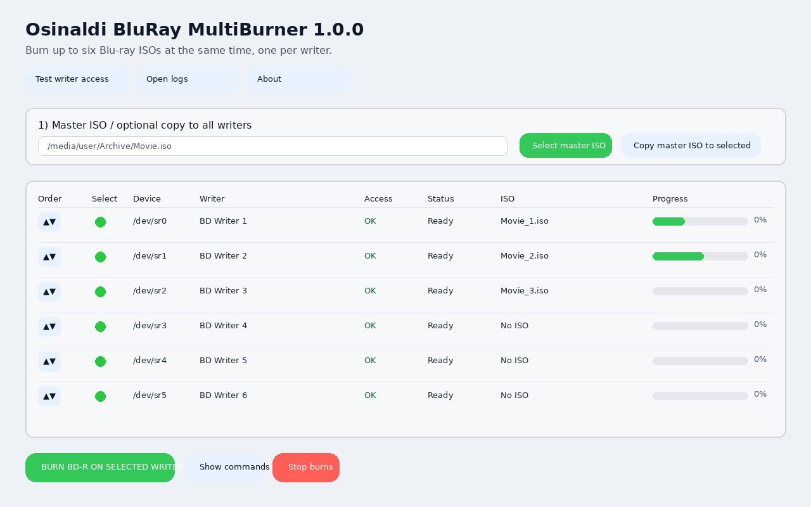
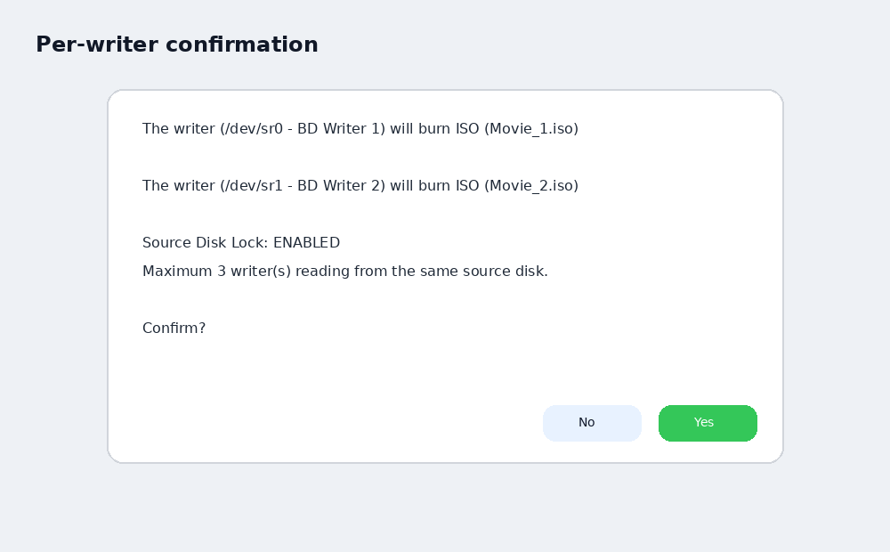

# Osinaldi BluRay MultiBurner

  

<h3 align="center">Osinaldi BluRay MultiBurner 1.0.24 — May 2026</h3>

  Linux GUI application for burning Blu-ray ISO images to multiple BD-R writers in parallel and creating ISO images from physical discs.

  <strong>Mirtza Chan</strong> is the official program mascot and application icon: 
  <em>a tribute to my beautiful and beloved wife.</em>

  <a href="https://euroanime.jp.net">Website</a> ·
  <a href="https://github.com/Phantasmum/Osinaldi-Bluray-MultiBurner">GitHub</a> ·
  <a href="mailto:phantasmum@proton.me">Contact</a>

  

  

---

**Osinaldi BluRay MultiBurner** is a Linux GUI application designed to make Blu-ray ISO burning simple, reliable, and practical for multi-writer workflows.

The program was created for users who need to burn multiple Blu-ray discs at the same time, especially when working with BD-R media, authored Blu-ray ISO files, anime collections, and compatibility-focused disc creation. It allows each Blu-ray writer to use its own ISO image, or the same master ISO can be copied to all selected writers when needed.

Unlike generic disc-burning tools, Osinaldi BluRay MultiBurner is focused on one clear purpose: burning Blu-ray ISO images to physical BD-R discs with a simple graphical interface, safe defaults, logs, and a workflow suitable for several drives running in parallel.

- Website: [https://euroanime.jp.net](https://euroanime.jp.net)
- GitHub: [https://github.com/Phantasmum/Osinaldi-Bluray-MultiBurner](https://github.com/Phantasmum/Osinaldi-Bluray-MultiBurner)
- Contact: [phantasmum@proton.me](mailto:phantasmum@proton.me)
- License: MIT
- Application ID: `io.github.osinaldi.bluraymultiburner`
- Debian package: `osinaldi-bluray-multiburner`

## Features

- Burn up to six Blu-ray ISO images in parallel.
- Assign a different ISO file to every Blu-ray writer.
- Copy one master ISO to all selected writers.
- Create ISO images from physical discs.
- Reorder writers in the GUI to match a physical stacked drive layout.
- Automatically save writer order between sessions.
- Source Disk Lock enabled internally with a fixed limit of 3 readers per source disk.
- Safe close protection while burning or reading.
- Strong stop confirmation to avoid accidental disc loss.
- Open logs button.
- Writer access test button.
- Native Ubuntu/Linux file picker through `zenity`.
- Compatibility-focused `growisofs` command line.
- Mirtza Chan mascot and program icon.

## Default writing profile

The default speed mode is 4x compatibility mode.

Typical command:

~~~bash
growisofs -dvd-compat -speed=4 -Z '/dev/sr0=/path/movie.iso'
~~~

The maximum/automatic speed option is shown in the GUI as:

~~~text
AWS / Max
~~~

## Requirements

Runtime dependencies:

- Python 3
- Tkinter
- dvd+rw-tools
- util-linux
- eject
- zenity
- coreutils

On Ubuntu/Debian these are installed automatically by the `.deb` package.

## Recommended permissions

For reliable optical writer access, add your user to the `cdrom` group:

~~~bash
sudo usermod -aG cdrom "$USER"
~~~

Then log out and log back in.

## Installation from DEB

Download the `.deb` package from the [Releases page](https://github.com/Phantasmum/Osinaldi-Bluray-MultiBurner/releases).

If the `.deb` is inside a ZIP file, extract it first.

Then install it with:

~~~bash
sudo apt install ./osinaldi-bluray-multiburner_1.0.24_all.deb
~~~

Launch from the app menu:

~~~text
Osinaldi BluRay MultiBurner
~~~

Or from terminal:

~~~bash
osinaldi-bluray-multiburner
~~~

## Portable Linux version

For Linux distributions that do not use `.deb` packages, download the Portable Linux ZIP or TAR.GZ from the [Releases page](https://github.com/Phantasmum/Osinaldi-Bluray-MultiBurner/releases).

Extract it, open a terminal inside the folder, and run:

~~~bash
./run.sh
~~~

Optional dependency installer:

~~~bash
./install_dependencies.sh
~~~

## Creating an ISO from a physical disc

Click:

~~~text
Create ISO from disc...
~~~

Select the source writer/reader, review the inserted disc information, choose the destination `.iso` file, and confirm.

The app uses `dd` internally with progress reporting.

## Logs

Logs are stored in:

~~~bash
~/OsinaldiBurnLogs/
~~~

## Configuration

Writer order is saved in:

~~~bash
~/.config/osinaldi-bluray-multiburner/settings.json
~~~

## Safety notes

Stopping an active optical burn can make discs unusable. The app requires typing:

~~~text
STOP BURN
~~~

before stopping active or queued operations.

## Linux store preparation

This repository includes:

- `.desktop` launcher
- AppStream metadata
- hicolor icons
- MIT license
- changelog
- known issues page
- Debian package
- Portable Linux archive

Keep the application ID stable:

~~~text
io.github.osinaldi.bluraymultiburner
~~~

## Known issues

Some Ubuntu App Center versions may not show custom icons for local `.deb` files before installation. After installation, the application menu should show the Mirtza Chan icon.

Some Linux systems require the user to be in the `cdrom` group before optical writers can be accessed reliably.

## License

MIT License. See [LICENSE](LICENSE).
